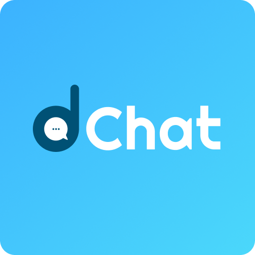
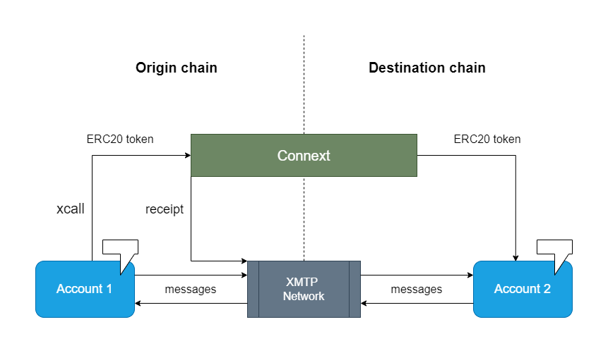

# dChat

Messaging application with chat-based cross-chain token transfers and NFT-gated access channels

<p align="center">
  
</p>

Use dChat for chain-agnostic messaging between any Ethereum accounts. Connect with others using the wallet addresses, ENS domains or Unstoppable domains. dChat also provides support for in-chat cross-chain ERC20 token transfers, currently between Optimism and Optimism-Goerli Testnets. It also provides exclusive NFT-gated group chats for accounts which own NFTs from any particular NFT collection.

## Architecture

<p align="center">
  
</p>


## Features

1. Chain-agnostic off-chain messaging
2. Support for ENS domains and Unstoppable domains
3. In-chat cross-chain token transfer
4. NFT-gated group chat for users who own NFTs of any particular collection


## Services used

- XMTP
- Connext
- Unstoppable domains
- ENS
- QuickNode NFT API
- Optimism-Goerli Test Network


## Setup locally

### Clone the repo

```
git clone https://github.com/renof112/dChat.git
cd dChat
```

### Install dependencies

```
npm i
```

### Run in development mode

```
npm run dev
```
